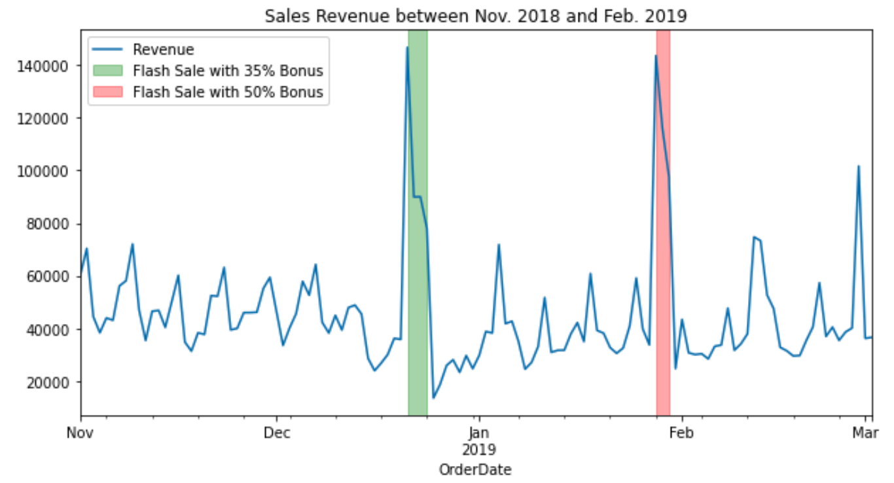
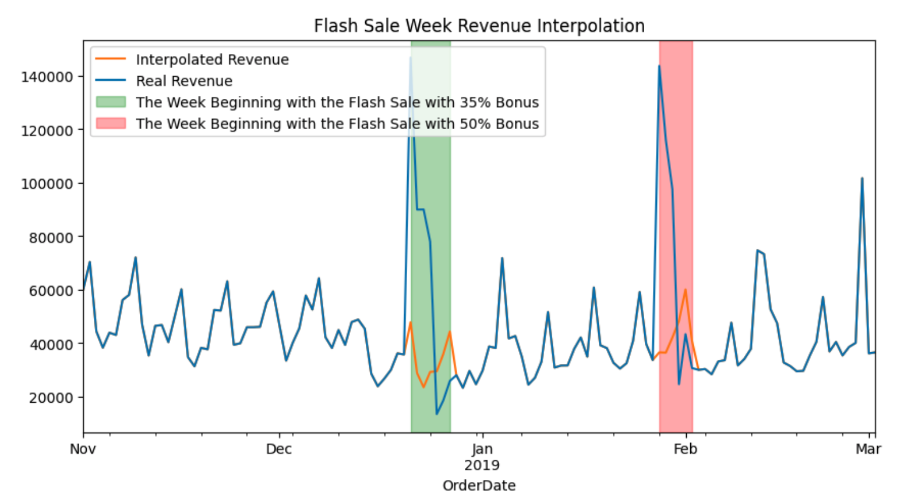
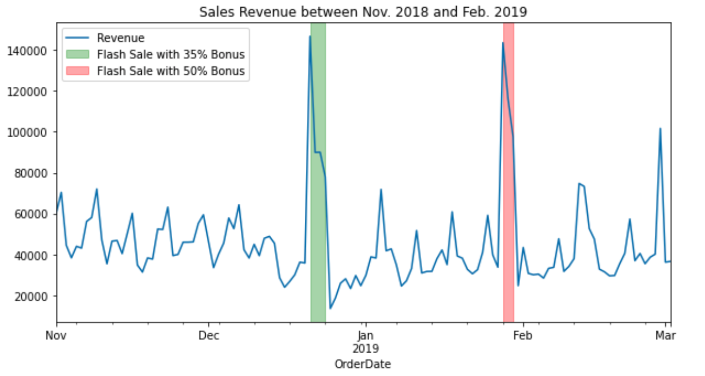
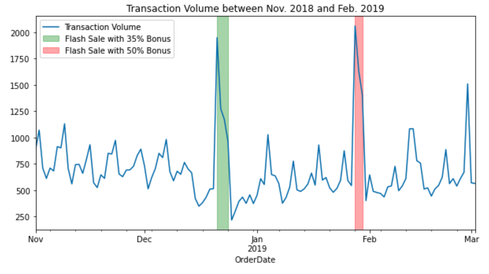
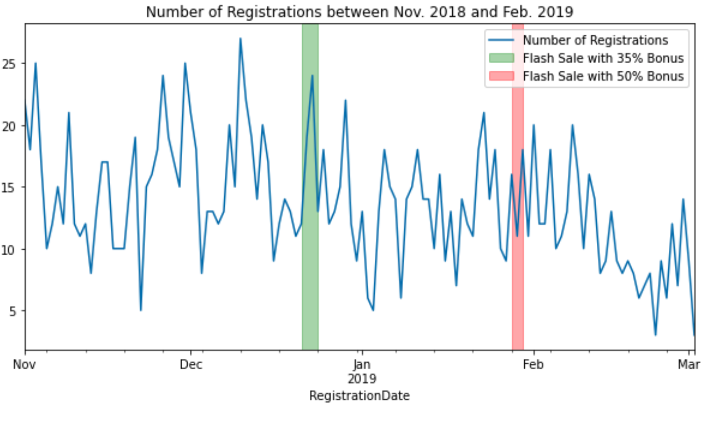
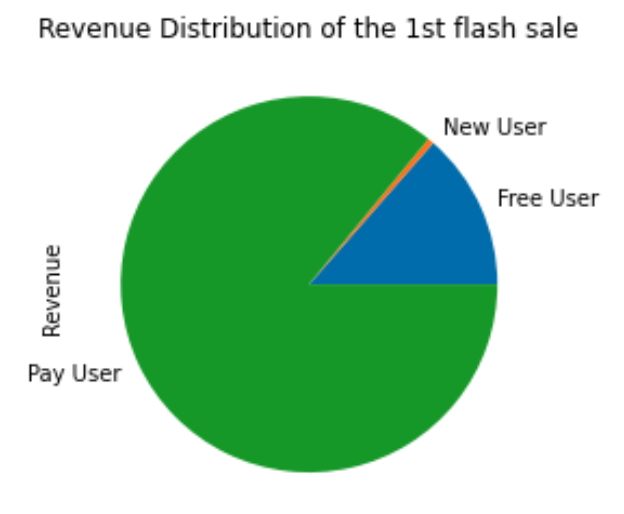
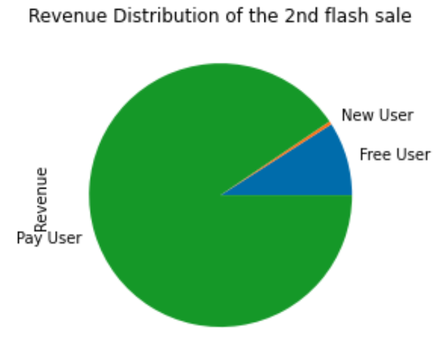
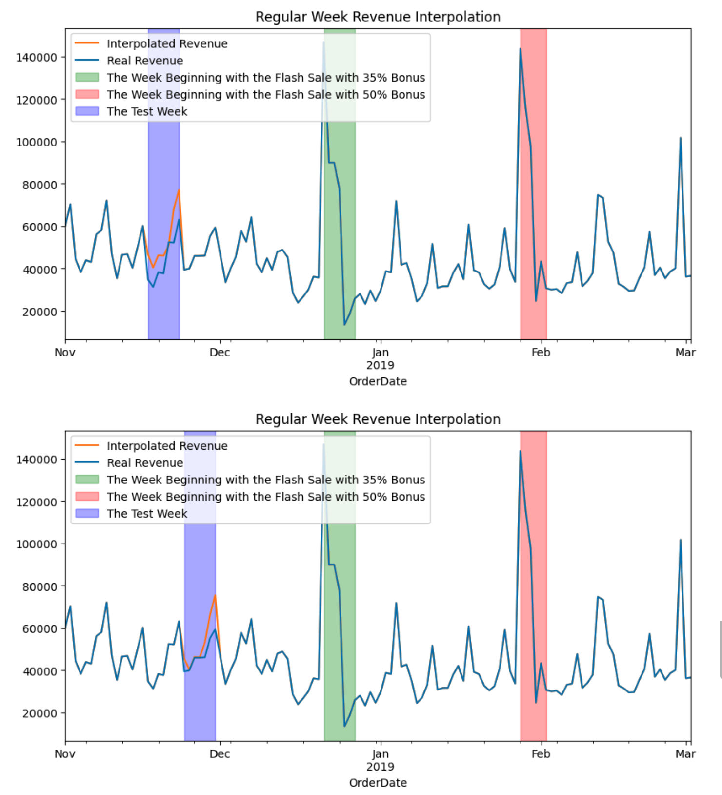
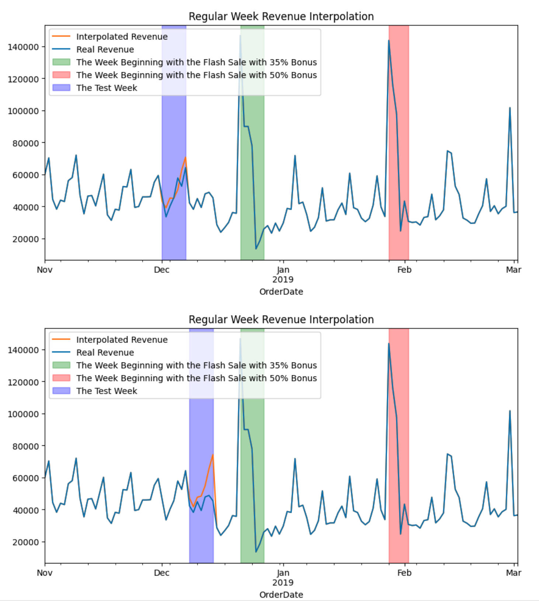

# Flash Sale Effect

Below is a real project of a game developing company that wants to **improve their market campaigns' performance** by extracting insights from their sales data!

I got that project as a take-home challenge for a data analyst position. It was fun; I learned a lot from it and so I thought I might as well share it with y'all!

## Skills Tested
- Time Series Analysis (Seasonality)
- Forecasting (SARIMA, AIC, etc)
- Data Visualization (Matplotlib)
- Data Wrangling (Pandas)

## Problem Statement
Everybody loves flash sales! It is a limited period where players receive more premium currencies than normal for the same amount of money.

In this example we have data in a timeframe going from November 1st, 2018 to March 2nd, 2019. In this timeframe 2 flash sales took place:
- First flash sale: from December 21st, 2019 to December 24th, 2018. 35% Diamonds bonus for the same price.
- Second flash sale: from January 28th, 2020 to January 30th, 2019. 50% Diamonds bonus for the same price.

  
## Tasks
- Determine the effect of each flash sale on the revenue. How much more (or less) revenue we could have achieved with each flash sale?
- Determine, based on the result of the first question, which one was more successful.

## Report
### Executive Summary
My solution is based on using a SARIMA model to interpolate the sales revenue of the weeks that begin with the Flash Sales(two 7-day windows). 

The blue line denotes the real revenue we generated throughout the time period, while the orange one represents the revenue we would have generated without the Flash Sales. 
Note that although flash sales spiked up the revenue initially during the week, we could see a dip short after the sales period ended, which was predicted by the model. 

**Therefore, by subtracting the real revenue from the interpolated revenue, 
we arrive at the solution that the first Flash Sale generated an additional 223108 euros, 
whereas the second 191266 euros, hence why the first was more successful.**
Besides, the second flash sale gave away more free gems while generating less extra revenue,
suggesting that the second flash sale is indeed inferior.

### Preliminary Data Analysis
A series of charts was created to help find some insights into the data and hopefully an inspiration for the solution. 
Here are a few remarks:

- Although transaction volumes and revenue peaked up during the flash sales, they did not have as much of an impact on the new registrations.
  
  
    
  
- Based on the previous charts, I discovered that during both sales, 
  80% of the revenue came from pay users (who had previously made a payment), 
  and only a small portion came from free users (who had never made a single payment until the sale). 
  That can potentially serve as another metric for the effectiveness of the flash sale, 
  because we hope to convert as many free users to pay users as possible.
  
  
  
- Last but not least, the following chart shows the revenue time series in normal periods has a weekly seasonality, 
  which serves as one of the bases for the specification of our model.
  
  
  
### Time Series Modeling
Since we have sales revenue for a few weeks, 
we can model use those data to infer how much revenue we could have generated without the flash sales, 
and compare it with the real revenue, and thus the difference represents the effect of the promotion.

However, before we dive into the modeling details, we need to consider a complication, 
which is the **cannibalization effect of promotions**: basically, if you run a sale on Monday, 
the revenue is going to increase that day, but it may fall below the average the following few days. 

Therefore, considering the seasonality effect of 7 days, 
I use 7 as a prediction window to model the ups and downs resulted from the Flash Sales. 
However, 14 could also be a good idea if we have data stretched out for a longer period.
To begin with, I remove the revenue data between 2018-12-21 and 2018-12-27 and 
between 2019-01-28 and 2019-02-02(the weeks starting with the flash sales).

Then, I specify several specifications of the SARIMA model, 
run them on our sales data, and pick the one that results in the least AIC(a metric denoting the performance of the model).

| row |       pdq |         PDQS | aic         |
|----:|----------:|-------------:|-------------|
|  1  | (0, 1, 1) | (0, 1, 1, 7) | 2192.201964 |
|  2  | (0, 1, 1) | (1, 1, 0, 7) | 2195.542225 |
|  3  | (1, 1, 0) | (0, 1, 1, 7) | 2195.681871 |
|  4  | (1, 0, 1) | (0, 1, 1, 7) | 2199.567266 |
|  5  | (0, 1, 1) | (1, 1, 1, 7) | 2203.496444 |

In the end, we have the specification (0, 1, 1) * (0, 1, 1, 7), which gives us the interpolation below:

Therefore, I arrive at the solution that the first Flash Sale generated an additional 223108 euros, 
whereas the second 191266 euros, hence why the first was more successful.

### Sanitary Check
To ensure that our model is doing a reasonable job when interpolating the revenues, 
I mask several periods without promotions and let the model make predictions. 
The following charts show that the model predictions are not far off from the reality, 
although it does have the tendency to overestimate the revenue, which with more time can be fine-tuned and resolved.

